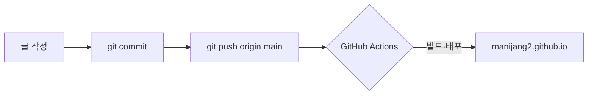

이 글은 **Chirpy 테마의 렌더링을 한 번에 확인**하기 위한 테스트입니다. 각 섹션이 의도대로 보이면 렌더링이 정상입니다.

## 1. 텍스트 서식

**굵게**, _기울임_, **_굵은 기울임_**, ~~취소선~~, `인라인 코드`, 그리고 [링크](https://manijang2.github.io)와 <https://github.com/manijang2> 자동 링크.

위 첨자 H~2~O, 아래 첨자 X^2^ 는 테마 설정에 따라 다를 수 있고, 키보드 표기는 <kbd>Ctrl</kbd> + <kbd>C</kbd> 처럼 나옵니다.

각주도 확인합니다[^footnote]. 두 번째 각주[^second]도 페이지 하단에 모입니다.

## 2. 목록

### 순서 없는 / 중첩

- 1단계 항목
  - 2단계 항목
    - 3단계 항목
- 다시 1단계

### 순서 있는

1. 첫째
2. 둘째
   1. 둘-하나
   2. 둘-둘
3. 셋째

### 할 일(Task list)

- [x] 저장소 생성
- [x] Chirpy 적용
- [ ] 첫 글 발행

### 설명 목록(Description list)

Jekyll
: 정적 사이트 생성기

Chirpy
: 기술 글쓰기에 특화된 Jekyll 테마

## 3. 인용문과 Chirpy 프롬프트

> 일반 인용문입니다. 여러 줄에 걸쳐
> 이어질 수 있습니다.

아래는 Chirpy 고유의 프롬프트 4종입니다.

> 팁: 이렇게 하면 편합니다.
{: .prompt-tip }

> 정보: 참고하면 좋은 내용입니다.
{: .prompt-info }

> 경고: 주의가 필요합니다.
{: .prompt-warning }

> 위험: 되돌릴 수 없는 작업입니다.
{: .prompt-danger }

## 4. 코드 블록 & 문법 강조

인라인 코드 `git push origin main` 과 블록 코드를 확인합니다.

```ruby
# 간단한 Ruby 예제
def greet(name)
  puts "안녕하세요, #{name}님!"
end

greet("선만")
```

파일명 라벨이 붙는 코드 블록:

```yaml
title: Seonman.Dev
lang: ko-KR
timezone: Asia/Seoul
```
{: file="_config.yml" }

```javascript
const sum = (a, b) => a + b;
console.log(sum(2, 3)); // 5
```

## 5. 표

| 기능        | 문법                     | 렌더링 확인 |
| :---------- | :----------------------- | :---------: |
| 굵게        | `**text**`               |      ✅      |
| 코드        | `` `code` ``             |      ✅      |
| 링크        | `[text](url)`            |      ✅      |
| 프롬프트    | `{: .prompt-tip }`       |      ✅      |

## 6. 이미지 + 캡션

{: width="120" height="120" .shadow }
_이미지 아래 이탤릭 줄은 자동으로 캡션이 됩니다_

## 7. 수식 (MathJax)

인라인 수식: 피타고라스 정리는 $$ a^2 + b^2 = c^2 $$ 입니다.

블록 수식:

$$
\begin{equation}
  \int_{a}^{b} f(x)\,dx = F(b) - F(a)
  \label{eq:calc}
\end{equation}
$$

식 $$\eqref{eq:calc}$$ 은 미적분학의 기본정리입니다.

## 8. 다이어그램 (Mermaid)



## 9. 접기/펼치기 & 구분선

<details>
  <summary>펼쳐서 보기</summary>
  숨겨진 내용입니다. HTML <code>&lt;details&gt;</code> 태그가 그대로 동작합니다.
</details>

---

여기까지 모두 정상으로 보이면 마크다운 렌더링은 완전합니다. 🎉

[^footnote]: 첫 번째 각주의 내용입니다.
[^second]: 두 번째 각주의 내용입니다.
